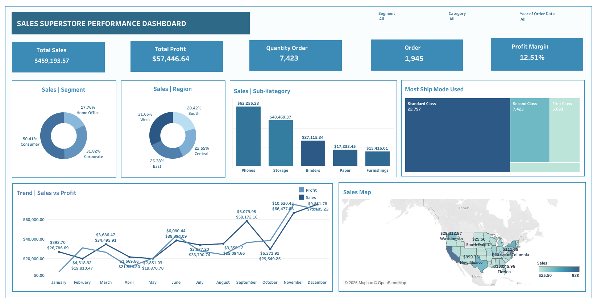

<div align="center">

# Sales Superstore Performance Dashboard

<a href="https://public.tableau.com/views/SalesSuperstorePerformanceDashboard_17908247274610/Dashboard3?:language=en-US&:sid=&:redirect=auth&:display_count=n&:origin=viz_share_link">
  
</a>

<br/>

### Interactive sales analytics dashboard for monitoring sales performance, profitability, customer segments, products, regional distribution, and shipping operations.

<br/>


<br/><br/>

[](https://public.tableau.com/views/SalesSuperstorePerformanceDashboard_17908247274610/Dashboard3?:language=en-US&:sid=&:redirect=auth&:display_count=n&:origin=viz_share_link)

<br/><br/>

[Overview](#-overview) •
[Objectives](#-project-objectives) •
[Dashboard](#-dashboard-sections) •
[Tech Stack](#️-tech-stack) •
[Workflow](#-project-workflow) •
[My Role](#-my-role) •
[Repository](#-repository-structure)

</div>

---

## 📌 Overview

**Sales Superstore Performance Dashboard** is an interactive business intelligence dashboard developed during my **Data Analyst Internship at PT Global Data Inspirasi (DataIns)**.

The dashboard is designed to provide a comprehensive overview of **sales performance, profitability, order volume, customer segments, product categories, shipping modes, and regional distribution**.

It transforms sales data into meaningful visual insights to support **performance monitoring, trend analysis, geographic analysis, operational analysis, and data-driven business decision-making**.

The dashboard was developed using **Tableau** to create interactive visualizations, KPI monitoring, geographic analysis, and business performance reporting.

> 🔗 **Live Dashboard:**  
> [Sales Superstore Performance Dashboard — Tableau Public](https://public.tableau.com/views/SalesSuperstorePerformanceDashboard_17908247274610/Dashboard3?:language=en-US&:sid=&:redirect=auth&:display_count=n&:origin=viz_share_link)

---

## 🎯 Project Objectives

The main objectives of this project were to:

- Monitor overall sales and profitability performance.
- Track total sales, profit, orders, and quantity sold.
- Measure overall profit margin.
- Analyze monthly sales and profit trends.
- Understand sales contribution across customer segments.
- Identify high-performing product sub-categories.
- Compare sales performance across geographic regions.
- Analyze state-level sales distribution through geographic visualization.
- Understand customer shipping preferences.
- Provide an interactive dashboard for business performance monitoring.
- Transform transactional sales data into actionable business insights.

---

## 📊 Key Performance Indicators

The dashboard provides several high-level business metrics:

| KPI | Value |
|---|---:|
| **Total Sales** | **$459,193.57** |
| **Total Profit** | **$57,446.64** |
| **Quantity Ordered** | **7,423** |
| **Total Orders** | **1,945** |
| **Profit Margin** | **12.51%** |

These KPIs provide an immediate overview of overall business performance and profitability.

---

## 📊 Dashboard Sections

The dashboard consists of four main analytical sections.

---

### 1. Sales Performance Overview

The **Sales Performance Overview** provides a high-level view of overall business performance.

It enables stakeholders to quickly monitor key sales and profitability indicators and identify changes in monthly performance.

#### Key Performance Indicators

- Total Sales
- Total Profit
- Quantity Ordered
- Total Orders
- Profit Margin

#### Trend Analysis

The dashboard compares:

- Monthly Sales
- Monthly Profit
- Sales vs. Profit trends
- Monthly performance fluctuations

This analysis helps identify periods of stronger or weaker sales performance and understand how profitability changes alongside revenue.

---

### 2. Customer & Product Analysis

The **Customer & Product Analysis** section analyzes how different customer segments and product categories contribute to overall sales.

#### Customer Segment Analysis

Sales performance is analyzed across:

- Consumer
- Corporate
- Home Office

This analysis helps identify which customer groups contribute the most to total sales.

#### Product Sub-Category Analysis

The dashboard highlights sales performance across major product sub-categories, including:

- Phones
- Storage
- Binders
- Paper
- Furnishings

This allows stakeholders to identify which product groups generate the highest sales contribution.

---

### 3. Regional & Geographic Analysis

The **Regional & Geographic Analysis** section evaluates sales performance across different geographic areas.

#### Regional Analysis

Sales are compared across:

- West
- East
- Central
- South

This provides insight into the geographic distribution of business performance.

#### Sales Map

A geographic sales map visualizes sales distribution across states.

The visualization helps identify:

- High-performing states
- Low-performing states
- Geographic concentration of sales
- Regional variations in sales contribution

This enables stakeholders to better understand where revenue is being generated geographically.

---

### 4. Shipping & Operational Analysis

The **Shipping & Operational Analysis** section examines how customers receive their orders.

Shipping modes analyzed include:

- Standard Class
- Second Class
- First Class

The analysis provides insight into:

- Customer delivery preferences
- Shipping mode distribution
- Order fulfillment patterns
- Most frequently used shipping methods

This can support further evaluation of operational and logistics strategies.

---

## 🖥️ Dashboard Preview

<p align="center">
  <a href="https://public.tableau.com/views/SalesSuperstorePerformanceDashboard_17908247274610/Dashboard3?:language=en-US&:sid=&:redirect=auth&:display_count=n&:origin=viz_share_link">
    
  </a>
</p>

<div align="center">

**Click the dashboard image above to open the interactive Tableau dashboard.**

</div>

---

## 🔍 Dashboard Components

The dashboard integrates multiple visualizations to provide a comprehensive view of business performance.

| Visualization | Purpose |
|---|---|
| **KPI Cards** | Monitor total sales, profit, quantity, orders, and profit margin |
| **Donut Chart — Segment** | Analyze sales contribution across customer segments |
| **Donut Chart — Region** | Compare sales contribution across regions |
| **Bar Chart — Sub-Category** | Identify top-performing product sub-categories |
| **Treemap — Ship Mode** | Analyze shipping mode distribution |
| **Line Chart — Sales vs Profit** | Monitor monthly sales and profitability trends |
| **Geographic Map** | Analyze sales distribution across states |
| **Interactive Filters** | Filter dashboard results by segment, category, and year |

---

## 🛠️ Tech Stack

<div align="center">


</div>

| Technology | Usage |
|---|---|
| **Tableau** | Data visualization, KPI development, interactive dashboard creation, geographic analysis, filtering, and business performance reporting |
| **Tableau Public** | Dashboard publication and interactive portfolio sharing |

---

## 🔄 Project Workflow

The project followed an end-to-end data analytics workflow:

```mermaid
flowchart LR
    A[Sales Dataset]
    B[Data Understanding]
    C[Data Cleaning]
    D[Data Transformation]
    E[KPI Development]
    F[Exploratory Analysis]
    G[Dashboard Development]
    H[Interactive Visualization]
    I[Business Insights]

    A --> B
    B --> C
    C --> D
    D --> E
    E --> F
    F --> G
    G --> H
    H --> I
```



---

### 1. Data Understanding

The sales dataset was explored to understand its structure and identify relevant variables for analysis, including:

- Sales
- Profit
- Quantity
- Orders
- Customer Segment
- Product Category
- Product Sub-Category
- Region
- State
- Shipping Mode
- Order Date

---

### 2. Data Preparation

The data was prepared to ensure consistency and suitability for visualization and business analysis.

The process included:

- Data inspection
- Data cleaning
- Data validation
- Data transformation
- Field formatting
- Data aggregation
- Preparation of dimensions and measures

---

### 3. KPI Development

Business metrics were developed to monitor overall sales performance.

The primary KPIs included:

- Total Sales
- Total Profit
- Total Quantity
- Total Orders
- Profit Margin

---

### 4. Exploratory Analysis

The dataset was analyzed across several business dimensions:

- Customer Segment
- Product Sub-Category
- Region
- Geographic Location
- Shipping Mode
- Monthly Sales
- Monthly Profit

This step helped identify important patterns before building the final dashboard.

---

### 5. Dashboard Development

The analytical results were transformed into an interactive dashboard using **Tableau**.

The dashboard incorporates:

- KPI Cards
- Donut Charts
- Bar Charts
- Treemap Visualization
- Line Charts
- Geographic Maps
- Interactive Filters

---

### 6. Insight Generation

The dashboard enables stakeholders to explore sales data from multiple perspectives and identify important business patterns related to:

- Revenue performance
- Profitability
- Customer contribution
- Product performance
- Regional performance
- Geographic sales distribution
- Shipping preferences

---

## 📈 Key Analysis Areas

### Sales Performance

Monitors overall sales activity using revenue, profit, order volume, quantity, and profitability metrics.

### Profitability Analysis

Analyzes overall profit performance and compares changes in profit with monthly sales trends.

### Customer Analysis

Evaluates sales contribution across Consumer, Corporate, and Home Office customer segments.

### Product Analysis

Identifies the product sub-categories contributing the most to overall sales.

### Regional Analysis

Compares business performance across West, East, Central, and South regions.

### Geographic Analysis

Uses state-level mapping to identify geographic differences in sales contribution.

### Operational Analysis

Examines shipping mode distribution to better understand customer delivery preferences.

---

## 💡 Dashboard Capabilities

The dashboard enables users and stakeholders to:

- Monitor sales and profitability KPIs.
- Evaluate monthly sales performance.
- Compare sales and profit trends.
- Analyze customer segment contribution.
- Identify high-performing product categories.
- Compare regional sales performance.
- Explore state-level geographic sales patterns.
- Understand shipping mode preferences.
- Filter analysis by segment.
- Filter analysis by category.
- Filter analysis by order year.
- Support data-driven business performance evaluation.

---

## 👨‍💻 My Role

As a **Data Analyst Intern at PT Global Data Inspirasi (DataIns)**, I developed the **Sales Superstore Performance Dashboard** to transform sales transaction data into interactive business insights.

My contributions included:

- Exploring and understanding sales datasets.
- Preparing data for analytical purposes.
- Developing business KPIs.
- Analyzing sales and profitability performance.
- Evaluating customer segment contribution.
- Analyzing product sub-category performance.
- Comparing regional sales distribution.
- Developing geographic sales analysis.
- Analyzing shipping mode distribution.
- Designing dashboard layouts.
- Developing interactive visualizations using Tableau.
- Implementing interactive dashboard filters.
- Transforming analytical results into understandable business insights.
- Publishing the dashboard through Tableau Public.

---

## 🧠 Skills Applied

This project demonstrates practical experience in:

- Data Analytics
- Exploratory Data Analysis
- Data Visualization
- Business Intelligence
- Dashboard Development
- KPI Development
- Sales Analytics
- Profitability Analysis
- Customer Segmentation Analysis
- Product Analysis
- Geographic Analysis
- Regional Analysis
- Operational Analysis
- Business Insight Generation
- Data-Driven Decision Support
- Tableau Dashboard Development

---

## 💼 Internship Information

| Information | Details |
|---|---|
| **Role** | Data Analyst Intern |
| **Company** | PT Global Data Inspirasi (DataIns) |
| **Project** | Sales Superstore Performance Dashboard |
| **Platform** | Tableau Public |
| **Tools** | Tableau |
| **Focus Areas** | Data Analytics, Business Intelligence, Dashboard Development, Sales Analytics |

---

## 📂 Repository Structure

```text
global-data-inspirasi-data-analyst/
│
├── README.md
│
└── assets/
    └── sales-superstore-dashboard.png
```

| File | Description |
|---|---|
| `README.md` | Main project documentation |
| `sales-superstore-dashboard.png` | Sales Superstore Performance Dashboard preview |

---

## 🔗 Live Dashboard

Explore the interactive dashboard through **Tableau Public**:

<div align="center">

[](https://public.tableau.com/views/SalesSuperstorePerformanceDashboard_17908247274610/Dashboard3?:language=en-US&:sid=&:redirect=auth&:display_count=n&:origin=viz_share_link)

</div>

---

## 📬 Contact

If you are interested in discussing this project, data analytics, business intelligence, or data visualization, feel free to connect with me through my GitHub or LinkedIn profile.

---

<div align="center">

## Sales Superstore Performance Dashboard

**Data Analyst Internship Project — PT Global Data Inspirasi (DataIns)**

`Tableau` • `Data Analytics` • `Business Intelligence` • `Sales Analytics`

<br/>

[](https://public.tableau.com/views/SalesSuperstorePerformanceDashboard_17908247274610/Dashboard3?:language=en-US&:sid=&:redirect=auth&:display_count=n&:origin=viz_share_link)

<br/><br/>

> **“Transforming sales data into actionable insights that drive better business decisions.”**

</div>
